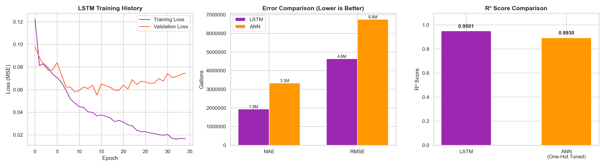

# 💧 Water Consumption Prediction — Data Mining Project

A deep learning pipeline for predicting monthly urban water demand using **ANN** and **LSTM** models, with an interactive Flask dashboard for visualization and real-time forecasting.



## 📊 Project Overview

| Feature | Details |
|---------|---------|
| **Dataset** | 22,294 records across 48 zones (Jan 2012 — Sep 2023) |
| **Best Model** | LSTM (R² = 0.9501) |
| **ANN Model** | Tuned MLP (R² = 0.8930) |
| **Dashboard** | Interactive Flask web app with EDA, model comparison & predictions |

## 🧠 Models

### LSTM (Long Short-Term Memory)
- **Architecture:** BiLSTM(128) → LSTM(64) → Dense(32) → Dense(1)
- **Approach:** 6-month sliding window sequences with autoregressive demand features
- **R² Score:** 0.9501 | MAE: 1.9M gallons | RMSE: 4.6M gallons

### ANN (Artificial Neural Network)
- **Architecture:** Dense(512) → Dense(256) → Dense(128) → Dense(64) → Dense(1)
- **Key Improvement:** One-Hot Encoding for categorical variables (R² jumped from 0.68 → 0.89)
- **R² Score:** 0.8930 | MAE: 3.3M gallons | RMSE: 6.8M gallons

## 📁 Project Structure

```
├── data_preprocessing.py    # Data cleaning & feature engineering
├── graph.py                 # EDA visualizations (6 charts)
├── ann_model.py             # ANN training & comparison with RF
├── lstm_model.py            # LSTM training & comparison with ANN
├── dashboard.py             # Flask dashboard (run this!)
├── templates/
│   └── dashboard.html       # Dashboard UI template
├── models/                  # Saved models & scalers (generated)
├── Zone_Level_Water_Weather_Merged.csv  # Raw dataset
├── cleaned_data.csv         # Preprocessed dataset
├── requirements.txt         # Python dependencies
└── *.png                    # Generated charts
```

## 🚀 How to Run

### 1. Install Dependencies
```bash
pip install -r requirements.txt
```

### 2. Run the Pipeline (first time only)
```bash
python data_preprocessing.py   # Clean & prepare data
python graph.py                # Generate EDA charts
python ann_model.py            # Train ANN model
python lstm_model.py           # Train LSTM model
```

### 3. Start the Dashboard
```bash
python dashboard.py
```
Open **http://127.0.0.1:5000** in your browser.

## 📈 Dashboard Sections

| Section | Description |
|---------|-------------|
| **Overview** | Dataset stats, model performance summary |
| **EDA Charts** | 6 visualizations (seasonal trends, correlations, distributions) |
| **Model Comparison** | LSTM vs ANN head-to-head analysis with charts |
| **Predict Demand** | Enter weather & zone params → get LSTM prediction |

## 🔧 Features Used

- **Weather:** Temperature (°F), Precipitation (inches), Humidity (%)
- **Time:** Cyclical month encoding (sin/cos), Season
- **Location:** Zone (zip code), Customer Class
- **Autoregressive:** Past water demand (LSTM only)

## 📦 Tech Stack

- **Python 3.x** — Core language
- **TensorFlow/Keras** — LSTM & ANN deep learning models
- **scikit-learn** — Preprocessing, metrics, Random Forest baseline
- **Flask** — Interactive web dashboard
- **Pandas, NumPy** — Data manipulation
- **Matplotlib, Seaborn** — Visualizations
